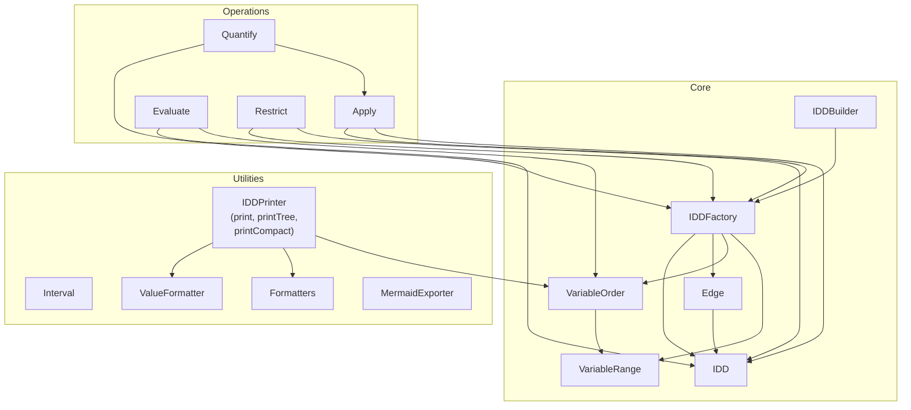
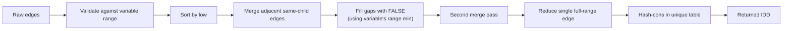

# Architecture & Design

## Overview

IDD Core implements **Interval Decision Diagrams** — a variant of Reduced Ordered Binary Decision Diagrams (ROBDDs) where edges represent integer intervals rather than Boolean cofactors. This allows compact representation of predicates over integer domains such as IP addresses, port ranges, or threshold conditions.

The project is a **multi-module Maven build**:
- `idd-core` — the library itself
- `idd-firewall` — firewall rule analysis tool (CLI)
- `idd-benchmark` — JMH benchmarks for performance evaluation

## Core design principles

1. **Immutability** — all core classes (`IDD`, `Edge`, `Interval`, `VariableOrder`, `VariableRange`) are `final` and immutable.
2. **Hash-consing** — the `IDDFactory` maintains a unique table (`WeakHashMap`) so structurally identical nodes share the same object identity.
3. **Reduction** — nodes with a single edge covering the full variable domain are eliminated, returning the child directly.
4. **Canonical representation** — thanks to hash-consing + reduction, two IDDs represent the same function iff they are `==` (reference-equal).
5. **Gap filling** — un-specified intervals default to FALSE, making the edge partition over the full variable domain.
6. **Variable ranges** — each variable can have a custom valid range (e.g., `0..65535` for ports, `0..255` for protocols). Gap filling and reduction use these range boundaries instead of `Integer.MIN_VALUE..Integer.MAX_VALUE`.

## Component diagram



## Key classes

### `IDD` (core)

Immutable node in the diagram. Terminal nodes are singleton `TRUE` / `FALSE` instances. Internal nodes have a variable index and an ordered list of edges. Equality is by reference (hash-consing guarantees canonicity).

### `Edge` (core)

Represents `[low, high] -> child`. Immutable. Edges are sorted and merged during normalisation.

### `IDDFactory` (core)

Singleton-scoped factory that:
- Normalises edge lists (sort, merge, fill gaps with FALSE).
- Applies reduction (eliminate single-edge full-range nodes).
- Hash-conses via a `WeakHashMap` unique table.
- Validates that edges fall within the variable's valid range.

The `WeakHashMap` allows unreachable nodes to be garbage-collected, making the factory safe for long-lived processes that create many temporary IDDs.

### `IDDBuilder` (core)

Fluent API for constructing IDDs from interval rules:

```java
factory.builder()
    .when("x").in(1, 10).then(true)
    .when("x").in(11, 20).then(false)
    .build();
```

For multiple variables, it builds independent single-variable IDDs and ANDs them together.

### `VariableOrder` (core)

Defines the fixed global ordering of variables. Lower index = higher in the diagram. Used by all operations to ensure canonical traversal. Each variable can have an associated `VariableRange` that defines its valid value domain.

### `VariableRange` (util)

Represents the valid value range `[min, max]` for a variable. Default is the full integer range `[MIN_VALUE, MAX_VALUE]`. Specialized ranges (e.g., `0..65535` for ports) constrain gap-filling and reduction to the semantic domain of the variable.

## Operations

### `Apply`

Implements the standard apply algorithm for BDDs, adapted for interval edges:
- **Binary**: AND, OR, XOR, IMPLIES via interval-aware traversal.
- **Unary**: NOT.
- Memoised via a `WeakHashMap` cache keyed on `(f, g, operation)`.
- Handles the three standard cases: same variable, left higher, right higher.

### `Evaluate`

Traces a path through the IDD given a variable-to-value assignment. Throws `IllegalArgumentException` if a required variable is missing.

### `Quantify`

- **Existential (`exists`)**: eliminates a variable by OR-ing all children of its node.
- **Universal (`forall`)**: eliminates a variable by AND-ing all children.

Both handle the case where the variable is absent in the subtree (return the node unchanged).

### `Restrict`

Cofactoring: fixes a variable to a concrete value and returns the resulting IDD. Recursively descends the diagram, following the matching interval edge at the target variable's level.

## Normalisation pipeline

When `IDDFactory.getNode()` is called:



## Variable ranges

Each variable can have a custom valid range defined in the `VariableOrder`:

```java
Map<String, VariableRange> ranges = Map.of(
    "port",  VariableRange.of(0, 65535),
    "proto", VariableRange.of(0, 255)
);
VariableOrder order = new VariableOrder(ranges, "proto", "port");
IDDFactory factory = new IDDFactory(order);
```

When a variable has a custom range:
- **Gap filling** uses the range's `min` instead of `Integer.MIN_VALUE` for the leading FALSE edge.
- **Gap filling** uses the range's `max` instead of `Integer.MAX_VALUE` for the trailing FALSE edge.
- **Reduction** eliminates a node when a single edge covers the full custom range `[min, max]`.
- **Validation** rejects edges whose bounds fall outside the variable's range.

Variables without an explicit range default to the full integer range `[MIN_VALUE, MAX_VALUE]`, preserving backward compatibility.

## Thread safety

All core classes are immutable and therefore thread-safe. The `IDDFactory` uses a `WeakHashMap`, which is **not** thread-safe — if concurrent factory access is needed, callers should synchronise or use a `ConcurrentHashMap` variant.
